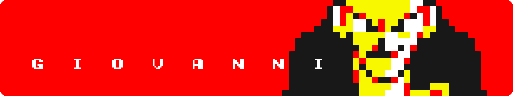
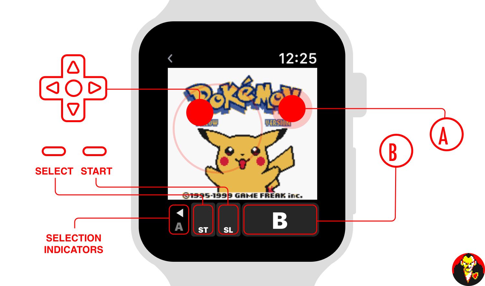

**A Gameboy Emulator for the Apple Watch.**

**Interested in how this was made? Check out the write-up [here](http://gabrieloc.com/2017/03/21/GIOVANNI.html)**

## Installation

Giovanni uses git submodules for it's one dependency, a modified version of the [Gambatte](https://github.com/gabrieloc/gambatte) emulator. When cloning, ensure submodules are also pulled down:

``` bash
$ git clone --recursive git@github.com:gabrieloc/GIOVANNI.git
```

If you are still having issues, please following the tutorial provided by [Redmond Pie](http://www.redmondpie.com/install-giovanni-game-boy-emulator-on-apple-watch-heres-how-tutorial/)

## Usage

Games are loaded from your iPhone's documents directory. In iTunes, drop `.gb` or `.gbc` files into the Giovanni app documents folder, and they'll show up automatically on your Apple Watch. When you play a game for the first time, it'll download to your watch and get cached in the watch's documents directory. Subsequent loads are immediate.

UPDATE: Giovanni can open ROMs natively, allowing you to bypass iTunes entirely. [More info](https://github.com/gabrieloc/GIOVANNI/pull/9).

Emulator saving and loading is automatic, and happens whenever the app gets closed/inactivated or opened/activated. In-game saving and loading is completely separate. If for some reason the emulator save gets corrupted, force-touching the screen will bring up the option to reset the emulator, allowing you to resume from your in-game save.

The control scheme is as follows:



## Troubleshooting

Disclaimer: Due to the constraints of watchOS, you may experience crashes or graphical glitches. Keep in mind that this project likely does not align with what Apple expects from the platform, which in turn makes it difficult to optimize and debug.

If for some reason the app becomes unresponsive and must be force-quit, you can do so by having the app in the foreground, pressing the side button, then pressing and holding the Digital Crown for about 5 seconds.

### Games don't show up
Because Giovanni relies on your iPhone for transferring games, ensure your paired iPhone is on and within reach.

### Garbled (or all white) pixels
Video memory often gets corrupt, in which case you will have to force emulation to be reset. While in-game, force touch the screen and select Reset. If the app closes after that, you will have to re-open, and repeat the process until it works.

### Colors wrong
Some games appear to format pixel data differently. The rendering work is done in [GameCoreSnapshots.swift](https://github.com/gabrieloc/GIOVANNI/blob/master/gambatte_watchOS/GameCoreSnapshots.swift), you may have luck adjusting how the Core Graphics context is created.

## Known Issues

### Games sometime crash when trying to fill the sound buffer
The sound buffer isn't even used, but required by Gambatte. The issue goes away after re-opening the app, but is a huge pain regardless.
